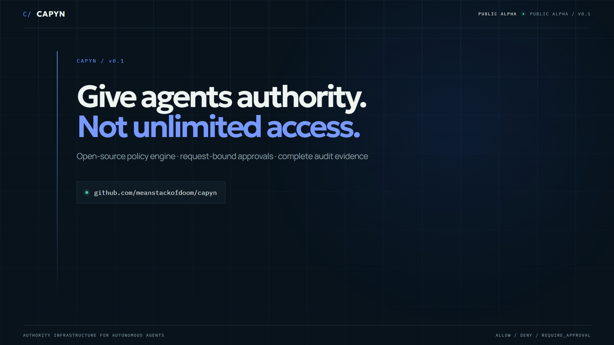
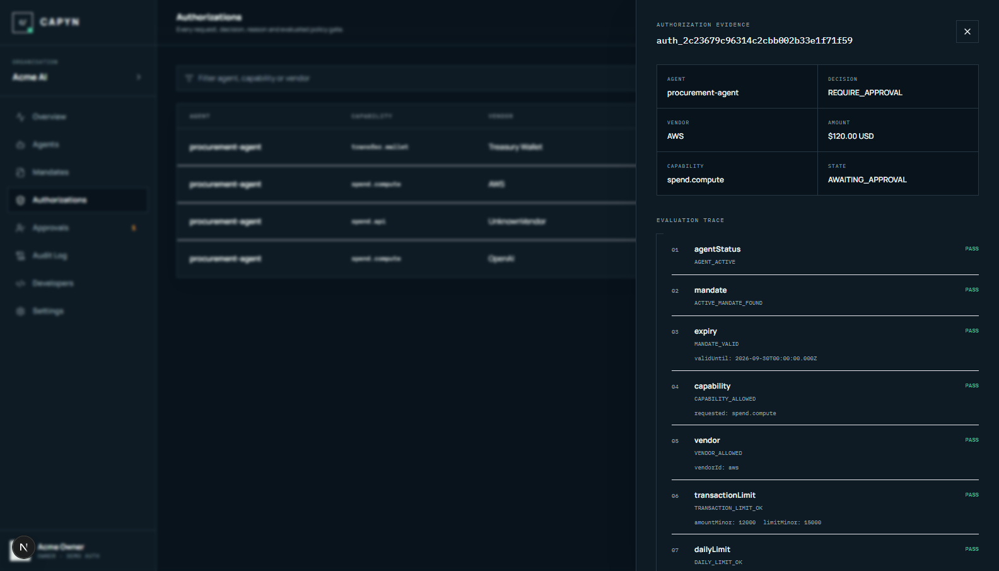

# CAPYN

**Authority infrastructure for autonomous agents.**

[](https://github.com/meanstackofdoom/capyn/actions/workflows/ci.yml)
[](LICENSE)

[Try the live CAPYN public alpha](https://capyn-production.up.railway.app) or inspect the [v0.1.0 release](https://github.com/meanstackofdoom/capyn/releases/tag/v0.1.0) with its generated video and dashboard evidence.

The hosted alpha is a synthetic, memory-backed demonstration with mock execution. Its state can reset during deployment, it contains no customer data, and it does not move real money.

CAPYN allows organisations to delegate constrained financial authority to AI agents using capabilities, spending limits, vendor policies, approvals and complete audit trails.

Give agents authority.

Not unlimited access.

```text
procurement-agent
      │
      ▼
POST /v1/authorize
      │
      ▼
CAPYN POLICY ENGINE
      │
      ├── ALLOW
      ├── DENY
      └── REQUIRE_APPROVAL
```

CAPYN is not a wallet, token, DAO or payment rail. It is the decision point before consequential execution. The v0.1 executor simulates payment; future adapters can settle through Solana/USDC, x402, Stripe, AP2 or another rail without moving policy enforcement into the adapter.

## See it in 24 seconds

[](outreach/video/capyn-public-alpha.mp4)

The [public-alpha video](outreach/video/capyn-public-alpha.mp4) is generated from the checked-in [Remotion source](apps/video/src/video.tsx), so the launch asset can evolve with the product instead of becoming an unrepeatable screen recording.

Requirements: Node.js 22+ and Corepack.

```bash
corepack pnpm install
corepack pnpm demo
```

The demo runs entirely in memory and exercises the real Fastify handlers and policy engine:

```text
✓ $18.00 → OpenAI
  ALLOW

✗ $30.00 → UnknownVendor
  DENY
  VENDOR_NOT_ALLOWED

! $120.00 → AWS
  REQUIRE_APPROVAL
  APPROVAL_THRESHOLD_EXCEEDED

✗ transfer.wallet · $20.00
  DENY
  CAPABILITY_NOT_GRANTED
```

The seeded hard per-transaction ceiling is `$150`, not `$50`. A `$50` hard ceiling and a `$120` approval example are logically incompatible: human approval must not silently override a hard policy maximum. The approval threshold remains `$100`; the daily and monthly limits are `$200` and `$2,000`.

## Public website

The public surface is a complete, responsive Next.js site:

- `/` — positioning, authority rail and the core demo story
- `/product` — lifecycle, policy model and execution boundary
- `/security` — implemented controls, concurrency and explicit limitations
- `/developers` — SDK, curl, REST surface and response contracts
- `/pricing` — open-source, hosted, design-partner and enterprise commercial model
- `/docs` — canonical repository documentation rendered as a public evidence register
- `/about` — the agent authority thesis and roadmap
- `/dashboard` — the working CAPYN control plane
- `/dashboard/billing` — plan allowances, live usage, projected fees and hosted checkout controls



Run just the public website:

```bash
corepack pnpm install
corepack pnpm --filter @capyn/web dev
```

Open `http://localhost:3010`. The marketing pages do not need the API or any external service.

## Run the complete local product

The default environment uses the in-memory repository, so the API, seeded control plane and website run without a database service:

```powershell
corepack pnpm install
Copy-Item .env.example .env
corepack pnpm dev
```

Open:

- Website and dashboard: `http://localhost:3010`
- API: `http://localhost:4000`
- API health: `http://localhost:4000/health`
- Website health: `http://localhost:3010/healthz`

The fixed demo key is documented in [docs/api.md](docs/api.md). It is valid only for disposable local or explicitly published CAPYN demo environments and must never protect durable data or real authority. PostgreSQL remains available as an optional repository adapter when a database is provisioned.

## Hosting handoff

The monorepo includes a platform-neutral root launcher for separate Railway-style web and API services. Set `CAPYN_SERVICE=web` or `CAPYN_SERVICE=api`, then run:

```bash
corepack pnpm build
corepack pnpm start
```

For a resource-constrained synthetic public demo, `CAPYN_SERVICE=combined` runs those same built processes behind one first-party proxy. It is deliberately not the durable/customer-data topology. Run `corepack pnpm smoke:combined` to verify that adapter; no Docker configuration is used.

The current synthetic public alpha is live at [capyn-production.up.railway.app](https://capyn-production.up.railway.app). Its Railway project, service and generated hostname all use the CAPYN name; a dedicated product domain remains a launch follow-up.

The selected service binds to `0.0.0.0` and respects the platform `PORT`. Set `NEXT_PUBLIC_SITE_URL` to the final public origin and use `/healthz` for the web health check. The API uses `/health`. No Docker configuration is required.

After a production build, run the self-contained deployment smoke gate on unused ports `3110` and `4110`:

```bash
corepack pnpm smoke:production
```

It starts the built services temporarily, proves all four authority decisions plus approval/execution, checks every public documentation route and dashboard noindex boundary, verifies SEO/security headers, and releases both ports when complete.

## Central API

```bash
curl -X POST http://localhost:4000/v1/authorize \
  -H "Authorization: Bearer $CAPYN_API_KEY" \
  -H "Idempotency-Key: inference-order-0001" \
  -H "Content-Type: application/json" \
  -d '{
    "capability": "spend.compute",
    "amount": { "value": "18.42", "currency": "USD" },
    "vendor": { "id": "openai", "name": "OpenAI" },
    "metadata": { "purpose": "Purchase inference capacity" }
  }'
```

The authenticated agent comes only from the API key. `agentId` is not accepted in the payload.

## TypeScript SDK

```ts
import { Capyn } from "@capyn/sdk";

const capyn = new Capyn({ apiKey: process.env.CAPYN_API_KEY! });

const result = await capyn.authorize({
  capability: "spend.compute",
  amount: { value: "18.42", currency: "USD" },
  vendor: { id: "openai" },
  metadata: { purpose: "Purchase inference capacity" }
});

if (result.decision === "ALLOW") {
  // Execute the exact authorised action.
}
```

## Repository

```text
apps/
  api/                 Fastify REST API and domain services
  video/               Reproducible Remotion launch video
  web/                 Next.js public website and App Router control plane
packages/
  billing/             Hosted plan catalogue, entitlements and overage calculator
  policy-engine/       Pure deterministic evaluator
  database/            Prisma/PostgreSQL and repository adapters
  sdk/                 Typed agent client
  types/               Shared schemas and contracts
docs/                  Architecture, security, API and roadmap
examples/              One-command demo and SDK example
outreach/techradar/    Launch outreach templates and proof checklist
outreach/video/        Rendered public-alpha video and cover
```

The important dependency direction is:

```text
identity → mandate → policy evaluation → authorization → approval → execution → audit
```

The policy engine does not know how PostgreSQL or Solana works. The executor does not decide permission. The web app is not a security boundary.

## Commands

```bash
pnpm demo          # four launch scenarios, no database required
pnpm dev           # API + web development servers
pnpm docs:check    # validate the canonical documentation catalog and links
pnpm test          # policy, SDK, API and security tests
pnpm typecheck     # all workspaces and examples
pnpm lint          # strict workspace lint
pnpm build         # production builds
pnpm check         # complete verification sequence
pnpm video:render  # render the 24-second public-alpha video
pnpm video:still   # render its social/README cover
pnpm media:screenshot # capture a live selected authorization trace
pnpm db:migrate    # deploy PostgreSQL migrations
pnpm db:seed       # seed Acme AI and procurement-agent
```

## Security posture

- Fail closed for absent, ambiguous or malformed policy.
- HMAC-SHA-256 API-key hashes at rest with a deployment pepper.
- API keys are organisation-scoped, revocable and bound to one agent.
- Strict Zod request schemas reject extra identity fields.
- PostgreSQL serializable transactions and per-agent advisory locks protect spend accounting.
- Organisation advisory locks protect hosted quotas across simultaneous agents.
- Approval rechecks every hard rule under the same lock and applies only to one authorization.
- Execution is claimed once with a unique database record after rechecking the agent and exact mandate binding.
- Audit events are append-only through the application and protected by a database trigger.
- Structured logs redact authorization and bootstrap headers.
- Stripe Checkout/portal remain server-side; Checkout and signed raw-body webhooks are both idempotent.

## Commercial model

The MIT-licensed policy engine remains free. The hosted Developer plan includes 3 active agents and 10,000 authorization decisions per month. Team is `$99/month`; Business is `$499/month`; Enterprise is scoped. Early design partners can be manually contracted at `$250–$1,000/month` for founder-led integration work.

CAPYN meters decisions, active agents, approval operations, audit evidence and integration connections. It never charges a percentage of money moved, and approvals carry no per-request fee. Stripe Checkout, customer portal and signed subscription webhooks are implemented when configured. Automated Stripe overage invoicing remains explicitly deferred; current overage values are durable, test-backed projections. See [Billing](docs/billing.md).

Read [docs/security.md](docs/security.md) before considering a non-demo deployment. v0.1 intentionally uses a demo human-auth adapter and a mock executor; both must be replaced for production.

## Documentation

- [Architecture](docs/architecture.md)
- [Getting started](docs/getting-started.md)
- [Configuration](docs/configuration.md)
- [Domain model](docs/domain-model.md)
- [Billing](docs/billing.md)
- [Website and brand system](docs/website.md)
- [Policy engine](docs/policy-engine.md)
- [Security](docs/security.md)
- [REST API](docs/api.md)
- [Deployment](docs/deployment.md)
- [Documentation policy](docs/documentation.md)
- [Project status](docs/project-status.md)
- [Public alpha launch checklist](docs/launch-checklist.md)
- [Solana roadmap](docs/solana-roadmap.md)
- [The Agent Authority Problem](docs/agent-authority-problem.md)
- [Changelog](CHANGELOG.md)

## Status

CAPYN v0.1 is a public, open-source developer MVP and public-alpha code package, tagged as [`v0.1.0`](https://github.com/meanstackofdoom/capyn/releases/tag/v0.1.0). It demonstrates bounded financial authorization end-to-end; it does not move real money. Hosted-demo progress and founder launch actions are tracked in [docs/project-status.md](docs/project-status.md). Deferred production work is explicit in [docs/security.md](docs/security.md) and [docs/solana-roadmap.md](docs/solana-roadmap.md).
